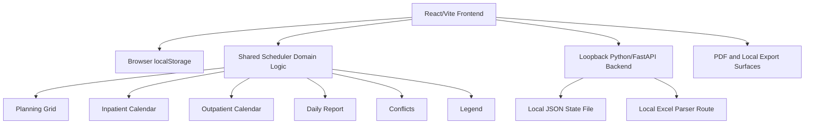

# High Level Design Specification

> **Partially superseded by commit `b01cce6` (2026-05-24).** Sections describing
> a **Node/Fastify** backend are out of date: the backend is now **Python/FastAPI**
> (`backend_py/`); the Node backend was removed. **Native reconciliation
> (2026-07-06):** the primary desktop product is now the SwiftUI macOS app
> (`macos/PediatricScheduler`) running a bundled Python/FastAPI scheduler engine.
> React/Vite remains the legacy browser/Docker path. See `README.md` for current
> app, backend, and packaging specifics.

## Project

**Application name:** Pediatric Neurology Scheduler  
**Document type:** High Level Design Specification  
**Version:** 2.1 - Native authority reconciliation, 2026-07-06
**Current shipping product:** Native SwiftUI macOS app v0.26.0 with bundled local-only Python/FastAPI scheduler engine; React/Vite remains the legacy browser/Docker path
**Prepared for:** Pediatric Neurology Scheduling Application  
**Primary user:** Pediatric Neurology scheduler, chief resident, fellow, program coordinator, or delegated scheduling owner  
**Primary goal:** Convert fragmented external rotator schedules into a validated pediatric neurology master roster, inpatient calendar, outpatient clinic calendar, daily team report, and exportable schedule package while keeping all data local to the user's machine.

---

## 0. Current Authority, Scope, and Design Constraints

### 0.1 Authority of this document

This document preserves the original high-level design context, but it has been updated to match the current product direction as of 2026-07-06.

The current requirements baseline is:

```text
docs/requirements/Pediatric_Neurology_Scheduler_Super_Requirements_2026-05-24.md
```

When older language in this document conflicts with that baseline, the baseline controls.

When sources conflict, use this authority order:

1. Binding user and Coordinator direction, including the 2026-05-20 local-only and no-off-machine design override.
2. Current native SwiftUI app, Python backend, shared contracts/engine, tests, release notes, and handoff artifacts. React/Vite remains authoritative for the legacy browser path.
3. The merged requirements baseline and its Claude/Codex source investigations.
4. Original Python/Qt desktop app, as historical provenance only.
5. Older HLD sections and deep-research recommendations, only when not superseded by the binding constraints.
6. Stale comments, stale release text, old roadmaps, and old phase plans, only after reconciliation.

### 0.2 Binding invariants

The following are binding constraints. A change that violates one of these is a regression unless the project owner explicitly reopens the governing decision.

| ID | Invariant | Current meaning |
|---|---|---|
| HLD-INV-001 | Local-only | The app runs on the end user's machine. State and files remain local. |
| HLD-INV-002 | No off-machine runtime communication | No remote HTTP, WebSocket, cloud sync, telemetry, analytics, remote logging, remote database, or remote AI. Loopback traffic is allowed. |
| HLD-INV-003 | Local-only does not mean frontend-only | A loopback-bound local backend is allowed for helper APIs, local persistence, and local parsing. |
| HLD-INV-004 | Loopback-only exposure | Frontend/backend services must be exposed only through localhost or host-side loopback. Docker wildcard binding is allowed only inside the container when host port mapping enforces loopback. |
| HLD-INV-005 | No AI/ML or solver-based optimization | No LLM parser, no machine learning, no preference learning, no CP-SAT, no OR-Tools scheduling, no stochastic or metaheuristic search. |
| HLD-INV-006 | Deterministic and rule-explainable automation | The same input should produce the same proposal. Generated choices must follow explicit rules. |
| HLD-INV-007 | Physician in control | The app proposes and assists. Coordinator or the human scheduler reviews, edits, and finalizes. |
| HLD-INV-008 | No silent guessing | Missing dates, ambiguous assignments, or source uncertainty must be surfaced for review rather than invented. |
| HLD-INV-009 | Workforce scheduler only | The app must not store patient names, MRNs, patient appointments, clinical documentation, or other patient-level PHI. |
| HLD-INV-010 | Manual entries win | Manual and existing assignments are preserved over generated or rule-created rows. |
| HLD-INV-011 | Additive state changes | New fields should be additive and backward tolerant. Existing saved states must continue to load safely. |
| HLD-INV-012 | Existing manual override surfaces are the refinement layer | Reuse drag/drop, paint mode, range assignment, direct editing, and conflict jump-to rather than creating parallel edit flows. |
| HLD-INV-013 | Inclusive date ranges | Eligibility and scheduling use start <= date <= end semantics. |
| HLD-INV-014 | Outpatient weekdays only | Outpatient scheduling is Monday-Friday. Inpatient coverage may include weekends and holidays based on coverage demand. |
| HLD-INV-015 | Customer handoff stays simple | Native customer use should not require source checkout or developer tools; the legacy browser handoff should require Docker Desktop and the release folder only. |

### 0.3 Superseded sections and terms

The following older ideas are preserved only as historical context. They are not active requirements unless the project owner explicitly reopens them.

| Superseded item | Current disposition |
|---|---|
| Remote backend, remote REST deployment, remote database, cloud sync, remote file store | Superseded by local-only and no off-machine constraints. |
| AI assistance layer, AI behavior and guardrails, AI parser confidence, LLM-assisted import | Superseded by no-AI and no-off-machine constraints. |
| CP-SAT, OR-Tools, MILP, min-cost flow, simulated annealing, tabu search, stochastic optimization | Superseded by deterministic rules-only scheduling. |
| RBAC/authentication tiers as product infrastructure | Superseded by single-user local model. Roles remain informational only. |
| Encrypted transport to remote systems | Superseded because off-machine transport is forbidden. Local host traffic remains on the machine. |
| Remote observability, telemetry, analytics, remote logging | Superseded by local-only constraint. |
| Automated external email, calendar, subscription, MedHub, New Innovations, Google Calendar, or Outlook integrations | Superseded unless explicitly reopened under a local-only or otherwise approved scope. |
| Python/Qt desktop app as current product | Superseded by the React/Vite rewrite, and later by the native SwiftUI macOS app. Python/Qt remains historical provenance only. |

### 0.4 Current product snapshot

The current primary product is a local-only native SwiftUI macOS application paired with a local-only Python/FastAPI scheduler engine. The React/Vite web application remains available as the legacy browser/Docker path.

> **Correction note (2026-05-24, commit `b01cce6`):** Sections below that reference "Node/Fastify" as the active backend are stale. The Node/Fastify backend was removed in v0.22.0. The Python/FastAPI backend (`backend_py/`) is THE shipping backend.

Current architecture summary:

- Native SwiftUI owns the primary desktop user interface.
- React/Vite owns the legacy browser user interface.
- The native macOS app launches the local Python/FastAPI backend from bundled Engine resources and uses backend command routes for scheduling workflows.
- The legacy browser path imports pure JavaScript domain logic from `shared/scheduler/` and runs it client-side through Vite.
- The backend serves the built React app as static files in the legacy production Docker path.
- Native state is the local backend JSON file; the legacy browser path uses browser `localStorage` with backend JSON mirror/recovery.
- Legacy browser Excel parsing is attempted via `POST /api/import/excel` first, but that route is **not implemented** in the Python backend (always 404); the browser-side parser is the real legacy path.
- Coordinator DOCX import is implemented in the native/backend path through local backend routes.
- All data, source files, logs, exports, and persisted state remain on the user's machine.
- Primary desktop handoff is a packaged native `.app`; legacy browser handoff is a Docker Desktop release folder.

Current local API surface (as of v0.26.0 Python/FastAPI backend):

| Route | Status | Purpose |
|---|---|---|
| `GET /api/health` | **Implemented** | Health and version check. |
| `GET /api/scheduler/state` | **Implemented** | Read local persisted scheduler state. |
| `POST /api/scheduler/state` | **Implemented** | Validate and write local scheduler state atomically. |
| `POST /api/scheduler/command` | **Implemented** | Execute native scheduler commands and persist changed state. |
| `POST /api/import/coordinator-docx` | **Implemented** | Parse selected local Master/Inpatient/Outpatient Coordinator DOCX paths. |
| `POST /api/import/coordinator-docx/default` | **Implemented** | Parse the known July 2026 Coordinator DOCX bundle from Downloads. |
| `GET /api/scheduler/initial-state` | Not implemented in backend — legacy browser handles client-side | Canonical initial state is constructed by the browser frontend. |
| `POST /api/scheduler/detect-conflicts` | Not implemented as a standalone backend route | Native conflict review uses `POST /api/scheduler/command` with `conflicts.list`; the legacy browser path can still run shared JS directly. |
| `POST /api/scheduler/generate-legend` | Not implemented as a standalone backend route | Native export and report workflows build legends through Python command/export helpers; the legacy browser path can still run shared JS directly. |
| `POST /api/import/excel` | Not implemented in backend — legacy browser handles client-side | Excel parsing falls back to browser-side SheetJS parser; the backend route always 404s. |

### 0.5 Current automation posture

Automation is decision support, not autonomy.

The v0.21.0 auto-draft feature targets roughly a 60/40 split:

```text
The app drafts the rule-bound majority.
The human scheduler reviews, corrects, and handles the judgment-heavy remainder.
```

Current auto-draft scope:

- Inpatient draft generation only.
- Deterministic fair-fill engine.
- Coverage demand by weekday, Saturday, Sunday, and holiday.
- Existing assignments are preserved.
- Availability, day-off, unavailable ranges, continuity clinic blocks, max consecutive inpatient days, no double-booking, and role eligibility are honored.
- Generated assignments are tagged.
- Over-constrained slots produce unmet reasons instead of fabricated assignments.
- Outpatient auto-draft remains deferred.

### 0.6 Why these constraints exist

The end user handles patient-adjacent workforce scheduling data. Off-machine communication would create privacy, security, and compliance burdens that are not justified for the current scope. The app's value is to make a real scheduling workflow safer and faster without moving data off the user's machine or hiding decisions behind opaque automation.

---

## 1. Executive Summary

The Pediatric Neurology Scheduler is a local, rules-driven scheduling orchestration system for an academic pediatric neurology service. It imports or manually receives schedules from multiple external programs, normalizes each rotator into a standard roster record, compares each rotator's actual rotation dates against the selected pediatric neurology service block, applies explicit program-specific rules, generates inpatient and outpatient planning views, detects conflicts, and exports physician-readable schedule documents.

The application is not a generic calendar, not a patient scheduler, and not an autonomous optimizer. It is a local workforce scheduling assistant that performs deterministic, explainable scheduling operations and leaves final decisions to the human scheduler.

The design centers around one critical principle:

```text
The service block defines the schedule window.
The rotator's actual dates define when that person can be scheduled.
```

---

## 2. Problem Statement

The current pediatric neurology scheduling workflow requires a human scheduler to gather information from several disconnected sources, interpret different rotation rules, manually determine who is present during the service period, separate rotators into inpatient and outpatient coverage, account for continuity clinics and half-day exceptions, and produce multiple schedule documents.

The workflow is difficult because:

- Schedule inputs come from multiple programs and institutions.
- Different rotator groups follow different date patterns.
- Pediatric neurology service blocks are most often 4 weeks but may be 5 weeks or custom.
- Individual rotators may be present for the full block, part of the block, a calendar month, a single week, or multiple separate date segments.
- Inpatient and outpatient schedules are separate operational products.
- Outpatient scheduling is session-based, with AM/PM clinic assignments by provider or clinic.
- Inpatient scheduling requires daily ON/OFF coverage, resident clinic pull-outs, team senior notes, fellow coverage, and special annotations.
- Existing schedules rely on rotator legends that must remain consistent with calendar cells.
- Manual schedules are vulnerable to double-booking, incorrect date assumptions, missing coverage, and cross-block continuity errors.

---

## 3. Goals

The application should accomplish the following goals:

1. Create a reliable master roster of everyone rotating through pediatric neurology during a selected service block.
2. Track each rotator's actual rotation date range or multiple date segments.
3. Import or receive schedules from Methodist Adult Neurology, UT Houston Adult Neurology, UT Houston Categorical Pediatrics, UT Houston Medical Students, UT Houston Psychiatry, and other sources.
4. Generate separate inpatient and outpatient work surfaces.
5. Preserve predetermined assignments when provided.
6. Apply program-specific rules when assignments are not predetermined.
7. Support Methodist 28-day rotation logic with 14 outpatient days and 14 inpatient days counted from the true Methodist rotation start.
8. Preserve cross-block continuity so assignments do not reset incorrectly at pediatric service block boundaries.
9. Support half-day scheduling logic for AM and PM sessions.
10. Track continuity clinics, resident clinics, CME, academic half-days, holidays, no-clinic days, day-off patterns, and unavailable date ranges.
11. Generate compact rotator legends and expanded name views.
12. Produce a daily team report showing who is where on a selected date.
13. Detect and explain scheduling conflicts.
14. Generate a local export package, CSV package artifacts, and PDF documents.
15. Keep Word and Excel export as open requirements unless explicitly descoped or implemented later.
16. Avoid raw JSON and developer jargon in physician-facing UI.

---

## 4. Non-Goals

The system should not attempt to solve every scheduling problem across the institution.

Out of current scope:

- Enterprise-wide residency scheduling across all specialties.
- Automated physician billing, payroll, duty-hour reporting, or accreditation reporting.
- Patient scheduling.
- Patient-level PHI handling.
- Remote database or cloud sync.
- Remote logging, telemetry, analytics, or external observability.
- Remote AI, local AI, LLM parsing, ML preference learning, CP-SAT, OR-Tools, or stochastic optimization.
- Fully autonomous outpatient clinic optimization.
- External email sending or external calendar event creation.
- SSO, institution-wide RBAC, or multi-user access-control infrastructure.
- Team sharing that sends data off-machine.
- Complex attending schedule optimization unless later reopened under explicit rules-only scope.

---

## 5. Users and Roles

The current product is single-user and local. The roles below describe workflow responsibilities, not authentication or permission tiers.

### 5.1 Scheduler

The scheduler is the primary user. This user imports schedules, reviews parsed records, edits rotator dates, generates drafts, resolves conflicts, and exports final documents.

### 5.2 Fellow

A fellow may review team coverage, inpatient assignments, outpatient assignments, and the daily team report.

### 5.3 Chief Resident or Administrative Owner

This role may define service block dates, coverage requirements, program rules, and export expectations.

### 5.4 Program Coordinator

A coordinator may provide external schedules, validate source data, and help maintain rotator information.

### 5.5 Viewer

A viewer may consume finalized schedules, daily reports, and exported documents.

---

## 6. Primary Workflow

The main scheduling workflow is:

```text
Create or select service block
        ↓
Import source schedules or manually enter rotators
        ↓
Preview, map, and normalize source data
        ↓
Create or update the Who's On Pedi roster
        ↓
Compare service block dates to each rotator's actual dates
        ↓
Apply predetermined assignments and program-specific rules
        ↓
Review Planning Grid, Inpatient, and Outpatient tabs
        ↓
Generate an inpatient draft where rules and coverage demand allow
        ↓
Apply half-day constraints and clinic/session logic
        ↓
Run conflict and rule checks
        ↓
Human scheduler reviews, edits, and resolves issues
        ↓
Generate legend, daily report, PDFs, and export package
```

The app should support this workflow without requiring source code, Node, npm, Python, Git, or off-machine services on the customer machine.

---

## 7. Core Scheduling Concepts

### 7.1 Service Block

A service block is the pediatric neurology scheduling window being built. Most service blocks are 4 weeks or 28 days. Some blocks may be 5 weeks or custom.

A service block contains:

- Block name.
- Start date.
- End date.
- Block type.
- Fellow coverage ranges.
- Inpatient coverage demand by weekday, Saturday, Sunday, and holiday.
- Inpatient calendar.
- Outpatient calendar.
- Holidays and no-clinic days.
- Academic half-days.
- Export status or readiness.

### 7.2 Actual Rotator Dates

Each rotator has true rotation date segments. The application must never assume that a rotator is present for an entire service block unless the rotator's actual segments say so.

Examples:

```text
Rotator A: May 4 - May 31
Rotator B: May 12 - May 16
Rotator C: May 1 - May 7 and May 24 - May 31
Rotator D: May 1 - May 31
```

### 7.3 Date Overlap Logic

For each rotator, the system compares actual date segments against the selected service block.

```text
Service block: May 4 - May 31
Rotator segment: May 12 - May 16
Visible and assignable dates: May 12 - May 16
```

If no overlap exists, the rotator is excluded from the visible schedule for that block while remaining stored for adjacent blocks if needed.

### 7.4 Inpatient Calendar

The inpatient calendar is a daily coverage calendar. It must support:

- ON list.
- OFF list.
- AM clinic pull-outs.
- PM clinic pull-outs.
- Continuity clinic notes.
- Team senior assignment.
- Fellow coverage.
- Academic half-day notes.
- Weekend coverage.
- Holiday coverage.
- Coverage demand.
- Daily notes.
- Conflict warnings.

### 7.5 Outpatient Calendar

The outpatient calendar is an AM/PM clinic session grid. It must support:

- AM clinics.
- PM clinics.
- Provider or clinic names.
- Clinic counts or expected patient volume when provided.
- Clinic locations.
- Assigned residents.
- Assigned medical students.
- Fellow clinic assignments.
- Continuity clinic notes.
- CME notes.
- Residents off.
- Medical students off.
- Holidays and no-clinic days.
- Stay-tuned or unresolved clinic assignments.

Outpatient scheduling is weekdays only unless the governing requirements are explicitly reopened.

### 7.6 Rotator Legend

The current scheduling style uses rotator legends. The application should generate and validate a temporary numbering or labeling system per schedule block or exported document.

Example:

```text
1 - Resident A, May 4 - May 17 [Tuesday PM continuity clinic]
2 - Resident B, May 4 - May 31 [Monday PM continuity clinic]
3 - Resident C, May 18 - May 31 [Thursday PM continuity clinic]
Fellow - Fellow A, May 4 - May 31 [Tuesday AM clinic]
MS - Medical Students
```

Calendar cells may display:

```text
Compact: ON: 1, 2, 4
Expanded: ON: Resident A, Resident B, Resident D
Both: ON: 1 Resident A, 2 Resident B, 4 Resident D
```

Shared versus separate legend numbering remains an open policy decision.

---

## 8. External Schedule Sources

The application must support schedules from the following source programs.

| Source Program | Pattern | Assignment Logic |
|---|---:|---|
| Methodist Adult Neurology | 28 days | 14 outpatient days and 14 inpatient days counted from the true Methodist rotation start. Do not reset at pediatric service block boundaries. |
| UT Houston Adult Neurology | 1-2 weeks, often 1 week at a time | Use actual start/end dates. Preserve imported or manually selected assignments. |
| UT Houston Categorical Pediatrics | 3-4 weeks | Use actual start/end dates. Preserve imported or manually selected assignments. |
| UT Houston Medical Students | Variable, often predetermined | Preserve provided inpatient/outpatient assignment unless explicitly overridden. |
| UT Houston Psychiatry | Calendar month | Use actual dates imported or entered from the psychiatry schedule. |
| Other | Variable | Use explicit dates and manual rules. Flag ambiguity for review. |

---

## 9. Program-Specific Scheduling Rules

### 9.1 Methodist Adult Neurology Rule

Methodist Adult Neurology residents follow a predictable 28-day rotation pattern.

Rule:

```text
Total rotation length: 28 days
Required outpatient time: 14 days
Required inpatient time: 14 days
Assignment basis: true 28-day Methodist rotation block
Boundary behavior: do not reset at the pediatric neurology service block boundary
```

The assignment must be calculated from the resident's actual Methodist rotation start date, not from the pediatric neurology service block start date.

Example:

```text
Methodist rotation: May 20 - June 16
Outpatient segment: May 20 - June 2
Inpatient segment: June 3 - June 16
Selected service block: June 1 - June 30
Correct visible assignment:
  June 1 - June 2: outpatient
  June 3 - June 16: inpatient
```

### 9.2 Psychiatry Rule

Psychiatry residents are usually assigned for a full calendar month. The system must use actual dates imported or entered from the psychiatry schedule. The psychiatry date range may not align with a 4-week pediatric neurology service block.

### 9.3 Pediatrics Resident Rule

Pediatrics residents are usually present for 3-4 weeks. The system must use actual start and end dates rather than assuming full-block availability.

### 9.4 UT Houston Adult Neurology Rule

UT Houston Adult Neurology residents are usually present for 1-2 weeks, often one week at a time. The system must support short date ranges within a larger service block.

### 9.5 Medical Student Rule

Medical student inpatient/outpatient assignments are often predetermined. The system must preserve those assignments unless a user explicitly overrides them.

---

## 10. Functional Requirements

### 10.1 Service Block Setup

The system shall allow users to create, edit, select, and delete pediatric neurology service blocks.

Required capabilities:

- Set block name.
- Set start date and end date.
- Select 4-week, 5-week, or custom block.
- Assign fellow coverage ranges.
- Mark holidays.
- Mark no-clinic days.
- Mark academic half-days.
- Configure inpatient coverage demand by weekday, Saturday, Sunday, and holiday.
- Enable inpatient calendar, outpatient calendar, daily report, legend, and export package.
- Prevent deletion of the final remaining service block.

### 10.2 Source Import and Parsing

The current native product shall support roster import/review, Coordinator DOCX import, source preview, manual entry, and manual column mapping. The legacy browser path shall continue to support Excel roster import and browser-side parsing.

Required capabilities:

- Upload and preview source files.
- Parse `.xlsx` rosters locally.
- Try backend Excel parsing first and fall back to browser parsing if the backend is unavailable.
- Preview parsed rows before committing.
- Merge by name, replace roster, or add as new.
- Support matrix/grid Excel rosters with week-start headers and `B` or `!B` marks.
- Preserve disjoint date segments.
- Support manual column mapping with auto-detected fields, live preview, and warnings for missing or duplicate critical fields.
- Avoid silent guessing when dates or assignments are missing.
- Retain source references locally, subject to a retention policy that remains open.

Dropped or open import capabilities:

- Coordinator DOCX import is shipped in the native/backend path for the known July 2026 bundle and user-selected local Master/Inpatient/Outpatient DOCX files.
- Generic Word/DOCX import beyond that Coordinator schedule workflow remains a possible latent need if new source-file formats arrive.
- Roster and Coordinator DOCX import routes cap request bodies, require absolute local paths, reject URL-like paths/unsupported extensions, and reject local source files larger than 25 MiB before parser entry.
- Richer binary preview warnings for odd source files remain optional polish.
- Source provenance granularity remains open.

The parser should attempt to extract or preserve:

- Rotator name.
- Program/source.
- Training level.
- Role.
- Actual rotation start date.
- Actual rotation end date.
- Multiple date segments, if present.
- Inpatient/outpatient assignment, if provided.
- Continuity clinic.
- CME.
- Off dates.
- Unavailable ranges.
- Medical student notes.
- Fellow notes.
- Clinic names.
- Clinic locations.
- Source file reference.

### 10.3 Master Who's On Pedi Roster

The system shall generate a master roster showing everyone active during the selected service block.

The roster shall include:

- Legend label or number.
- Name.
- Training level.
- Program/source.
- Role.
- Actual date segment or segments.
- Assignment: inpatient, outpatient, mixed, off, unknown, or not in block.
- Continuity clinic.
- Day-off pattern.
- Unavailable ranges.
- Notes.
- Daily grid.
- Status.
- Conflicts.
- Per-segment pre-assignments.
- Single rotator delete and bulk delete.

Rotator contact information beyond scheduling metadata remains an open decision.

### 10.4 Planning Grid and Manual Editing

The Planning Grid shall be the main visual scheduling work surface.

Required capabilities:

- Rotator-by-day matrix.
- Weekday columns.
- Status colors and visual categories.
- Active-in-block filtering.
- Totals by day.
- Unassigned, mixed, inpatient, outpatient, off, absent, and not-in-block cell states.
- Drag a rotator name onto a cell with validation before assignment.
- Refuse invalid drops with visible feedback.
- Paint mode for bulk assignment across one row.
- Preserve row and mode boundaries during paint.
- Break outpatient weekend runs correctly.
- Range assignment that clamps to block dates, skips invalid dates, reports applied versus skipped counts, and supports inpatient, outpatient, and clear.
- Additive outpatient range behavior, not destructive behavior.

Touch and accessibility acceptance criteria for dense badges and tooltip-only details remain open.

### 10.5 Inpatient Calendar Generation

The system shall generate a daily inpatient calendar.

Each day should support:

- ON assignments.
- OFF assignments.
- AM clinic pull-outs.
- PM clinic pull-outs.
- Resident clinic notes.
- Continuity clinic notes.
- Team senior.
- Fellow coverage.
- Academic half-day.
- Holiday or weekend notation.
- Free-text notes.
- Coverage demand and understaffed coverage warnings.
- Conflict warnings.

### 10.6 Outpatient Calendar Generation

The system shall generate an outpatient AM/PM clinic assignment calendar.

Each outpatient day should support:

- AM session.
- PM session.
- Multiple clinic rows per session.
- Provider or clinic name.
- Clinic count.
- Location.
- Assigned rotators.
- Assigned medical students.
- Fellow clinic assignment.
- Continuity clinic notes.
- CME.
- Medical student off notation.
- Residents off notation.
- No-clinic notation.
- Stay-tuned notation.
- Multiple rotators assigned to one attending/session.

### 10.7 Daily Team Report

The system shall produce a single-day report showing:

- Date and day of week.
- Fellow coverage.
- Inpatient ON list.
- Inpatient OFF list.
- Clinic pull-outs.
- Team senior.
- Outpatient AM assignments.
- Outpatient PM assignments.
- Medical students.
- Continuity clinics.
- CME.
- Academic half-day.
- Holiday/no-clinic notes.
- Conflicts.
- Copyable text summary.

### 10.8 Conflict Detection

The system shall identify hard conflicts, warnings, and informational notes.

Conflicts should include:

- Missing actual rotation dates.
- Invalid date ranges.
- Person scheduled outside actual dates.
- Day-off assignment.
- Assignment inside an unavailable range.
- Person assigned inpatient and outpatient in the same day/session without an allowed pull-out or explicit exception.
- Missing required inpatient coverage.
- Understaffed inpatient coverage based on coverage demand.
- Missing fellow coverage when configured.
- Duplicate person with conflicting records.
- Rotator number or label used without legend entry.
- Missing legend entries.
- Continuity clinic conflicts for inpatient and outpatient.
- Holiday/no-clinic outpatient sessions.
- Predetermined assignment overwritten.
- Team senior missing when configured.
- Clinic marked stay tuned.
- Legend rotator unused.

The Reports conflict navigator should route the user to the page where the issue can be fixed. Native conflict focus scroll-and-highlight is shipped for Inpatient, Outpatient, Planning Grid, and Clinics targets.

### 10.9 Rules and Auto-Draft

The current auto-draft system shall:

- Target an approximately 60 percent app-generated and 40 percent human-reviewed workflow.
- Generate inpatient draft assignments only.
- Use the configured coverage demand model.
- Preserve all existing assignments.
- Fill required open inpatient slots most-constrained-first.
- Use fair deterministic selection based on current load and stable tie-breaks.
- Honor availability constraints.
- Honor day-off and unavailable ranges.
- Avoid continuity-clinic conflicts when drafting.
- Enforce max consecutive inpatient day limits.
- Avoid double-booking.
- Honor role eligibility.
- Tag generated assignments as auto-draft.
- Return unmet reasons for over-constrained days.

Outpatient auto-drafting is deferred and should not be mixed into the current inpatient auto-draft without a separate scope decision.

### 10.10 Export

The system shall export local schedule artifacts.

Current shipped or expected export content:

- Master Who's On Pedi roster.
- Inpatient calendar.
- Outpatient clinic calendar.
- Daily team report.
- Rotator legend.
- Conflict summary.
- Source import summary when available.
- Scheduler state backup or export package for local recovery/transport.

Current shipped format:

- PDF, including combined PDF and separate inpatient/outpatient PDFs.
- Local copyable text/report surfaces.
- Local backup/export package with JSON, text, and CSV handoff artifacts.

Open export asks:

- Word export.
- React Excel export.
- Additional CSV shapes beyond the shipped package artifacts, if requested.
- Export versioning, finalization metadata, and change-reason ledger.

All exports are local downloads only. No cloud destination is permitted.

---

## 11. Non-Functional Requirements

### 11.1 Usability

The application should match the mental model of current schedule documents. Users should be able to recognize inpatient ON/OFF calendars, outpatient AM/PM clinic grids, and rotator legends without learning a completely foreign scheduling paradigm.

User-facing UI should avoid raw JSON and developer jargon. JSON may exist internally for storage, APIs, backup, and diagnostics.

### 11.2 Reliability

The system should never silently guess critical missing information. If assignment or date information is incomplete, the record should be flagged for review.

Regression-sensitive areas include:

- Local-only/offline contract.
- Loopback binding.
- Backend JSON mirror and recovery.
- Date segment eligibility.
- Methodist 28-day true-start logic.
- Manual-entry preservation.
- Outpatient weekdays-only behavior.
- Drag/drop validation.
- Paint row and mode boundaries.
- Additive outpatient range assignment.
- Multi-rotator outpatient session saves.
- Multi-role inpatient assignment identity.
- Conflict jump routing.
- Legend mismatch and missing coverage checks.

### 11.3 Auditability

Every schedule assignment should be traceable locally to one of the following:

- Imported source schedule.
- Program rule.
- Manual user entry.
- Manual override.
- Rules-based auto-draft accepted by a human.

No audit or provenance data may be shipped off-machine. A formal durable audit ledger remains an open product decision.

### 11.4 Security and Privacy

The application is a workforce scheduling tool, not a patient scheduling or clinical documentation system.

Minimum privacy expectations:

- No patient names.
- No medical record numbers.
- No patient appointment details.
- No patient-level clinical documentation.
- No off-machine communication.
- Local file and browser storage only.
- OS file-system permissions are the primary trust boundary.
- Configurable retention policy for uploaded source files remains open.
- Local deletion or archival policy for old source documents remains open.

Authentication, RBAC, encrypted transport to remote systems, and institution-wide access control are superseded by the single-user local model unless the scope is explicitly reopened.

### 11.5 Performance

The application should support rapid schedule generation for a pediatric neurology block with dozens of rotators, multiple clinics per day, and multiple source documents.

Performance targets from the original design remain useful but are not yet confirmed as measured current acceptance criteria:

```text
Source parsing preview: under 10 seconds for typical uploaded schedule package
Roster generation: under 3 seconds
Draft calendar generation: under 5 seconds
Conflict validation: under 5 seconds
Daily report load: under 2 seconds
```

If performance becomes a release gate, these targets should be revalidated and converted into measured tests.

### 11.6 Maintainability

Program-specific rules should be isolated in shared domain logic. Frontend UI code and backend route code should not duplicate scheduling rules.

Rules should be structured so future explicit rule additions can be tested without introducing AI, stochastic optimization, or remote services.

---

## 12. Current High-Level Architecture

The current product uses a modular local architecture with clear separation between UI, domain logic, persistence, import parsing, conflict detection, and export generation.



### 12.1 Frontend

The frontend is a desktop-first React application.

Primary pages:

1. Dashboard.
2. Block Setup.
3. Sources.
4. Who's On Pedi.
5. Planning Grid.
6. Inpatient.
7. Outpatient.
8. Daily Report.
9. Conflicts.
10. Legend.
11. Rules.
12. Configuration.
13. Export.

Planning Grid, Inpatient, and Outpatient operate as one tabbed work surface in the current product.

### 12.2 Local Backend

The backend is local-only and loopback-bound. It is not a remote service.

> **Correction note (2026-05-24):** The backend is now Python/FastAPI (`backend_py/`). The Node/Fastify backend was removed. The backend is intentionally minimal — conflict detection, legend generation, initial-state construction, and Excel parsing all run client-side in the browser.

Current backend responsibilities:

- Serve health/version (`GET /api/health`).
- Read local persisted scheduler state (`GET /api/scheduler/state`).
- Validate and write scheduler state atomically (`POST /api/scheduler/state`).
- Serve the static React build in Docker production.

The following are **not** backend responsibilities (handled client-side by the frontend via shared JS):

- Constructing initial state.
- Detecting conflicts.
- Generating legend entries.
- Parsing Excel workbook bytes.

### 12.3 Shared Scheduler Domain Logic

The scheduling engine is deterministic and rules-first.

The engine should:

- Compare service block dates with rotator date segments.
- Determine active dates per rotator.
- Apply predetermined assignments.
- Apply program-specific rules.
- Preserve cross-block continuity.
- Apply half-day constraints.
- Generate inpatient and outpatient assignments.
- Generate legend entries.
- Produce conflict metadata.
- Generate a rules-based inpatient draft when requested.

No AI/ML, CP-SAT, OR-Tools, stochastic search, or remote service is part of the scheduling engine.

---

## 13. Current Data Model

### 13.1 Current State Overview

The current native product stores scheduler state as versioned local JSON through the bundled backend. The legacy browser path also uses the same backward-tolerant scheduler state shape.

Conceptual top-level state:

```text
version
activeBlockId
serviceBlocks[]
sources[]
rotators[]
attendings[]
expectedSourcePrograms[]
inpatientAssignments[]
outpatientSessions[]
rules
notes[]
```

### 13.2 ServiceBlock

```text
id
name
startDate
endDate
status
generate
holidays[]
coverage
```

Coverage demand is additive and may contain:

```text
weekday.ip.count
saturday.ip.count
sunday.ip.count
holiday.ip.count
weekday.ip.byRole
saturday.ip.byRole
sunday.ip.byRole
holiday.ip.byRole
```

### 13.3 Rotator

```text
id
fullName
displayName
program
level
role
segments[]
schoolType
continuityClinic
dayOff[]
unavailableRanges[]
notes
```

### 13.4 RotatorSegment

```text
start
end
assignment
source
notes
```

Segments use inclusive-end date semantics.

### 13.5 Attending

```text
name
recurringClinics[]
oneOffDates[]
```

### 13.6 InpatientAssignment

```text
id
date
rotatorId
role
source
notes
```

Assignment identity is date + rotator + role. Multi-role-per-day inpatient assignments are intentional when roles differ.

### 13.7 OutpatientSession

```text
id
date
period
clinic
provider
rotatorId
status
notes
```

Session identity is date + period + rotator. Multiple rotators may share a session.

### 13.8 Source

```text
id
program
fileName
fileType
content
parsedRows[]
uploadedAt
notes
```

Source retention and provenance granularity remain open decisions.

### 13.9 Conflict

```text
id
severity
category
date
rotatorId
title
description
targetPage
status
```

Formal durable resolution fields such as `resolvedBy`, `resolvedAt`, and `resolutionNotes` remain open unless implemented.

### 13.10 LegendEntry

```text
label
rotatorId
displayName
program
level
dateRangeLabel
continuityClinic
```

Fellow numeric versus label behavior and shared versus separate legend numbering remain open policy decisions.

---

## 14. Scheduling Algorithms

### 14.1 Roster Generation Algorithm

```text
Input:
  service block
  source schedules
  rotator records

For each source schedule:
  parse source data locally
  extract rotator candidates
  normalize candidates into rotator records
  validate required fields

For each rotator:
  for each actual date segment:
    calculate overlap with service block
    if overlap exists:
      include segment in visible roster
    else:
      store segment but exclude from visible block view

Generate roster rows.
Generate preliminary legend entries.
Flag missing dates, unknown assignments, duplicates, and source conflicts.
```

### 14.2 Program Assignment Algorithm

```text
For each visible rotator segment:
  if assignment is predetermined:
    preserve imported or manually entered assignment
  else if program is Methodist Adult Neurology:
    apply 28-day true-start rule
    calculate position from true Methodist rotation start date
    assign 14-day outpatient and 14-day inpatient phase
    preserve continuity across pediatric service block boundary
  else:
    apply explicit source-program rules when configured
    if assignment remains unknown:
      flag for review

For each active date:
  create date-level assignment only when rules or manual state justify it
  apply continuity clinic, CME, day-off, unavailable ranges, and academic half-day constraints
```

### 14.3 Inpatient Auto-Draft Algorithm

```text
Input:
  current state
  active service block
  coverage demand

Preserve all existing assignments.

For each date in the block:
  calculate required inpatient headcount from coverage demand
  calculate current non-off inpatient headcount
  identify open slots

Order open dates most-constrained-first:
  fewer eligible rotators first
  earlier date as tie-break

For each open slot:
  find eligible rotators under hard rules
  choose eligible rotator with the lightest current inpatient load
  use stable deterministic tie-breaks
  write assignment tagged Auto-Draft

If no eligible rotator exists:
  add unmet reason
  do not fabricate an assignment
```

### 14.4 Inpatient Calendar Generation Algorithm

```text
For each date in service block:
  identify rotators assigned inpatient on that date
  apply AM/PM constraints
  mark ON/OFF status
  add resident clinic pull-outs
  assign or validate team senior
  attach fellow coverage
  add holiday/weekend/academic notes
  run coverage checks
```

### 14.5 Outpatient Generation Algorithm

```text
For each weekday in service block:
  load known AM and PM clinic templates or imported clinic sessions
  identify outpatient-eligible rotators
  remove unavailable rotators for each session
  preserve predetermined student assignments
  apply continuity clinic and CME notes
  assign rotators to clinic sessions through manual or explicit rule paths
  mark no-clinic, residents-off, medical-students-off, or stay-tuned sessions
  run clinic conflict checks
```

### 14.6 Legend Generation Algorithm

```text
Input:
  visible rotators
  service block
  assignment outputs

Sort rotators by configured display rule.
Assign numeric labels to residents/rotators.
Assign separate labels for fellows and medical students when appropriate.
Include date range labels and continuity clinic labels.
Validate that every calendar number or label appears in the legend.
Validate that every legend entry appears in the schedule or is intentionally unused.
```

---

## 15. Conflict Detection Rules

### 15.1 Date Validity Rules

```text
A rotator cannot be scheduled before their actual segment start date.
A rotator cannot be scheduled after their actual segment end date.
A rotator with no overlapping segment cannot appear in the visible block schedule.
A segment end date cannot precede its start date.
```

### 15.2 Assignment Conflict Rules

```text
A rotator cannot be inpatient and outpatient in the same day/session unless represented by an allowed pull-out or explicit approved exception.
A rotator marked OFF cannot also be assigned to clinic unless explicitly approved.
A rotator on a day-off pattern cannot be assigned without warning or conflict.
A rotator in an unavailable date range cannot be assigned without conflict.
A rotator in CME cannot be assigned elsewhere during the same session unless approved.
A rotator in continuity clinic cannot be assigned elsewhere during the same session unless approved.
A predetermined medical student assignment should not be overwritten without warning.
```

### 15.3 Coverage Rules

```text
Required inpatient coverage must satisfy the configured demand count.
Understaffed inpatient days must be flagged.
Fellow coverage should exist when configured.
Team senior should be assigned when required.
Outpatient clinic sessions should either have assignments or explicit no-clinic/stay-tuned status.
Holiday/no-clinic days should not contain active clinic assignments unless explicitly approved.
```

### 15.4 Legend Rules

```text
Every number or label used in the calendar must exist in the legend.
No duplicate legend number may exist in the same export package.
Every legend entry should appear in the schedule unless intentionally marked unused.
Fellow and medical student labels should be distinguishable from numbered resident labels.
```

---

## 16. User Interface Pages

### 16.1 Dashboard

Purpose: Provide a high-level status view of the service block.

Key elements:

- Service block summary.
- Source import status.
- Rotator counts by program.
- Inpatient calendar status.
- Outpatient calendar status.
- Conflict count.
- Export readiness.
- Expected source readiness.

### 16.2 Block Setup

Purpose: Define the schedule period and coverage demand.

Key elements:

- Block name.
- 4-week, 5-week, or custom block type.
- Start and end dates.
- Fellow coverage.
- Holiday/no-clinic days.
- Calendars to generate.
- Inpatient coverage demand.
- Explanation that actual rotator dates drive eligibility.

### 16.3 Sources

Purpose: Import external schedules and validate parsed source records.

Key elements:

- Source cards for each program.
- Excel import.
- Generic source preview.
- Manual entry options.
- Parsed rotator table.
- Column mapping.
- Missing data indicators.
- Source-specific rule indicators.
- Merge choice.

### 16.4 Who's On Pedi

Purpose: Central roster of active rotators.

Key elements:

- Name.
- Training level.
- Program.
- Actual date ranges.
- Assignment status.
- Continuity clinic.
- Day-off checkboxes.
- Unavailable ranges.
- Daily grid.
- Notes.
- Conflict status.
- Rotator detail controls.
- Single delete.
- Bulk delete.
- Active-in-block filtering.

### 16.5 Planning Grid

Purpose: Main visual scheduling work surface.

Key elements:

- Rotator-by-day matrix.
- Colored cell states.
- Totals.
- Active-in-block filter.
- Drag/drop assignment.
- Paint assignment.
- Range assignment.
- Planning Grid, Inpatient, and Outpatient tab group.

### 16.6 Inpatient

Purpose: Daily inpatient coverage view.

Key elements:

- Sunday-Saturday calendar grid.
- ON/OFF lists.
- AM/PM clinic pull-outs.
- Continuity clinic pills or labels.
- Team senior.
- Fellow.
- Academic half-day.
- Legend.
- Coverage warnings.
- Generate draft schedule button.

### 16.7 Outpatient

Purpose: AM/PM clinic schedule.

Key elements:

- Monday-Friday clinic grid.
- AM and PM sections.
- Clinic/provider rows.
- Clinic counts.
- Locations.
- Assigned residents.
- Medical students.
- Fellows.
- Continuity clinic.
- CME.
- No clinic.
- Residents off.
- Stay-tuned entries.

### 16.8 Daily Report

Purpose: Single-day operational summary.

Key elements:

- Date selector.
- Fellow.
- Inpatient ON/OFF.
- Team senior.
- Clinic pull-outs.
- Outpatient AM/PM assignments.
- Medical students.
- Special notes.
- Conflicts.
- Copyable daily text.

### 16.9 Conflicts

Purpose: Review and resolve issues.

Key elements:

- Critical/warning/info counts.
- Conflict list.
- Severity indicators.
- Suggested fix target.
- Jump-to-page action.
- Plain-language descriptions.

Native conflict focus scroll-and-highlight is shipped. Further visual refinement is polish, not missing state behavior.

### 16.10 Legend

Purpose: Review the current block's rotator legend.

Key elements:

- Resident labels or numbers.
- Fellow labels.
- Medical student labels.
- Date range labels.
- Continuity clinic labels.
- Missing legend or mismatch warnings.

### 16.11 Rules

Purpose: Configure current local scheduling rules.

Key elements:

- Methodist rule settings.
- Max consecutive inpatient days.
- Holiday/no-clinic behavior.
- Coverage demand visibility.
- Plain-language explanation of conflict checks.

Rules page copy should reflect the actual conflict detector, including unavailable/day-off, missing/understaffed coverage, missing legend, and continuity conflicts.

### 16.12 Configuration

Purpose: Configure local app settings and attending profiles.

Key elements:

- Attending profiles.
- Recurring clinic patterns.
- One-off clinic dates.
- Expected source programs.
- Theme or display options.

### 16.13 Export

Purpose: Export schedule documents and local backup artifacts.

Key elements:

- Export readiness.
- Combined PDF.
- Separate inpatient PDF.
- Separate outpatient PDF.
- Local backup/export package.
- Conflict summary.
- Legend inclusion.

---

## 17. Current Local API Design

The current API is local-only and loopback-bound. It is not a remote REST deployment.

> **Correction note (2026-05-24):** As of v0.22.0, the backend is Python/FastAPI. Only three routes are implemented in the backend. The remaining four routes listed below are NOT implemented; those operations run client-side in the browser.

### 17.1 Health — IMPLEMENTED

```http
GET /api/health
```

Returns local app health, package name, and version.

### 17.2 Initial State — NOT IMPLEMENTED (client-side)

```http
GET /api/scheduler/initial-state
```

> This route is not implemented in the Python/FastAPI backend. Initial state is constructed client-side by the frontend. Do not write contract tests against this route.

### 17.3 Conflict Detection — NOT IMPLEMENTED (client-side)

```http
POST /api/scheduler/detect-conflicts
```

> This route is not implemented in the Python/FastAPI backend. Conflict detection runs client-side in the browser via shared JS. Do not write contract tests against this route.

### 17.4 Legend Generation — NOT IMPLEMENTED (client-side)

```http
POST /api/scheduler/generate-legend
```

> This route is not implemented in the Python/FastAPI backend. Legend generation runs client-side in the browser via shared JS. Do not write contract tests against this route.

### 17.5 State Persistence — IMPLEMENTED

```http
GET /api/scheduler/state
POST /api/scheduler/state
```

The POST route validates state against the current scheduler-state contract before writing to disk. Persistence is local JSON using atomic write behavior.

### 17.6 Excel Import — NOT IMPLEMENTED (client-side fallback)

```http
POST /api/import/excel
```

> This route is not implemented in the Python/FastAPI backend (always 404). The client attempts this route and on any non-2xx falls back to browser-side SheetJS parsing. The browser fallback is the real shipping path. Do not write contract tests against this route.

### 17.7 Superseded API Surface

Older endpoint sketches such as `/api/service-blocks`, `/api/rotators`, `/api/exports`, remote source upload endpoints, and remote conflict resolution endpoints are historical design ideas only. They are not current requirements for the local React product.

---

## 18. Rules-Based Automation Behavior and Guardrails

### 18.1 Automation Responsibilities

Rules-based automation may assist with:

- Applying the Methodist 28-day rule.
- Applying explicit per-segment pre-assignments.
- Filling required open inpatient coverage slots.
- Explaining conflicts in plain language.
- Generating legends.
- Generating daily reports.
- Generating export-ready local PDFs and text.

### 18.2 Automation Restrictions

Automation must not:

- Finalize schedules without human approval.
- Override predetermined or manual assignments without review.
- Delete source records silently.
- Invent dates when missing.
- Invent clinic assignments when the source data is unclear.
- Make untraceable changes.
- Handle patient-level information.
- Use AI/ML, LLM parsing, CP-SAT, OR-Tools, stochastic search, or remote inference.

### 18.3 Explainability Requirement

Every generated assignment should be explainable.

Example assignment explanation:

```text
Resident A was assigned inpatient on June 3 because the configured coverage demand required another inpatient resident, the resident was active on that date, was not unavailable, did not exceed max consecutive inpatient days, was not double-booked, and had the lightest current inpatient load among eligible residents.
```

Example conflict explanation:

```text
Resident B is listed as inpatient on May 21 and also assigned to an outpatient clinic that day. This needs review unless the outpatient item is an intended pull-out or approved exception.
```

---

## 19. Import and Parsing Strategy

### 19.1 Current Parsing Pipeline

```text
Upload source file
        ↓
Parse locally through backend or browser
        ↓
Detect columns or apply manual column mapping
        ↓
Extract rotator names, dates, assignments, clinics, notes, and constraints
        ↓
Normalize into standard records
        ↓
Compare against known rotators and existing records
        ↓
Display parsed preview to user
        ↓
User chooses merge mode
        ↓
User approves or edits
```

### 19.2 Review Status

The parser should produce user-reviewable statuses or warnings rather than AI confidence scores.

Examples:

```text
Ready
Needs Review
Missing Dates
Assignment Unknown
Duplicate Person
Source Conflict
Manually Edited
```

Fields that are missing, duplicated, ambiguous, or mapped manually should be visible for review.

### 19.3 Human Review

The system should require review when:

- Dates are missing.
- Assignment is unknown.
- Source text contains ambiguous labels.
- A name appears in multiple sources with conflicting dates.
- A rotator has multiple non-contiguous segments.
- A schedule cell refers to a legend number that is not defined.
- Matrix cells contain `!B` until that semantic is formally decided.

---

## 20. Export Design

### 20.1 Export Package

The export package currently includes these manifest files:

```text
manifest.json
roster.json
roster.csv
inpatient-calendar.json
inpatient-calendar.csv
outpatient-calendar.json
outpatient-calendar.csv
daily-reports.txt
legend.json
legend.csv
conflicts.json
conflicts.csv
source-import-summary.json
source-import-summary.csv
schedule-package.json
```

Backend, shared-domain, and native static tests pin this manifest list.

### 20.2 Export Display Modes

```text
Compact numbers
Expanded names
Numbers and names
```

### 20.3 Current Export Formats

Current native product and supported legacy browser path:

```text
PDF
Separate inpatient PDF
Separate outpatient PDF
Combined PDF
Editable Word/DOCX schedule, daily report, and roster/legend handoff files
CSV package artifacts
Copyable text surfaces
Local backup/export package
```

Open or dropped export formats:

```text
Word export: shipped in the native/backend handoff path; optional formatting refinements remain open
CSV export: shipped as local package artifacts; only additional CSV shapes remain open
Excel export: existed in Python, dropped in React
Printable HTML: web views exist, explicit export flow should be verified
```

### 20.4 Export Versioning

Final export versioning remains open.

Potential future version metadata:

- Export timestamp.
- Exported by.
- Service block ID.
- Remaining warnings.
- Critical conflict count.
- Change reason if edited after finalization.

---

## 21. Security and Compliance Design

The application is designed as a local workforce operations tool. It should not store patient-specific clinical data.

### 21.1 Current Security Model

Current model:

```text
Single-user local app
Loopback-only network exposure
No off-machine communication
Local browser storage
Local backend JSON mirror
Local Docker volume
OS file-system permissions as trust boundary
```

### 21.2 Local Audit and Provenance

Local audit/provenance should track as feasible:

- Source imports.
- Parsed record approvals or merge decisions.
- Date changes.
- Assignment changes.
- Rule-generated assignments.
- Manual overrides.
- Conflict reviews.
- Exports.

A formal durable audit UI/table remains open.

### 21.3 Data Protection

Minimum expectations:

- No patient-level data storage.
- No remote transport.
- No telemetry or analytics.
- No remote logging.
- Local source files and generated exports remain on the machine.
- Manual deletion, archival, and source retention policy remains open.

RBAC, institution SSO, encrypted off-machine transport, and remote permissions are not active requirements under the current single-user local model.

---

## 22. Deployment Architecture

### 22.1 Current Deployment

The current primary customer deployment is a packaged native macOS `.app`. The legacy browser deployment remains a Docker Desktop release folder.

The customer should need:

```text
Primary native handoff:
PediatricScheduler.app or PediatricScheduler-macOS.zip
macOS right-click Open guidance when quarantine applies

Legacy browser handoff:
Docker Desktop
CoordinatorPediSchedulerReact release folder
run-on-mac.command
stop-app.command
compose.yaml
prebuilt Docker image tarball
image hash file
README
WHATS_NEW
```

The customer should not need:

```text
Node
npm
Python
Git
source checkout
remote account
cloud database
```

### 22.2 Runtime Exposure

Legacy browser default local URL:

```text
http://localhost:6173
```

The legacy browser release supports a `PORT` override. The native app launches its bundled loopback backend without requiring the user to open a URL. Host-side port exposure must remain loopback-only.

### 22.3 Persistent Local Data

Current persistent local data:

```text
Native backend JSON state file
Legacy browser localStorage
Legacy Docker volume: pedi_scheduler_react_data
Legacy container path: /home/app/.local/share/pedi_scheduler
Shared file name: scheduler-state.json
```

The release README and handoff documentation must describe this accurately.

### 22.4 Superseded Deployment Model

The older model below is superseded:

```text
Frontend Web App
Backend API Server
PostgreSQL Database
Object Storage
AI Parsing Service / LLM Gateway
Background Job Queue
Institution SSO
Remote analytics
```

---

## 23. Observability and Operations

Remote observability is out of scope.

Permitted local operational behavior:

- Local browser console errors during development.
- Local Docker/container logs.
- Local user-visible error messages.
- Local validation failures.
- Local backup/export files.
- Local tests.

Prohibited runtime behavior:

- Remote telemetry.
- Remote analytics.
- Remote logging.
- Remote error reporting.
- Cloud sync.
- Remote metrics collection.

Useful local checks:

- `npm test`
- `npm run test:offline`
- `npm run build`
- Docker handoff contract tests
- Manual customer release smoke test

---

## 24. Current Shipping Scope

The current native v0.26.0 product includes:

- Service block setup.
- Local-only native SwiftUI macOS app.
- Local-only bundled Python/FastAPI scheduler engine (`backend_py/`; Node/Fastify backend removed).
- Local backend JSON state file.
- Sources page with roster import/review and Coordinator DOCX import.
- Column mapping.
- Matrix roster review with include/exclude handling for `!B` marks.
- Who's On Pedi roster.
- Date segments and active-block filtering.
- Inpatient calendar.
- Outpatient calendar.
- Clinics/attending placement surface.
- Daily report.
- Planning Grid/Inpatient/Outpatient tabbed surface.
- Drag/drop assignment.
- Paint assignment.
- Range assignment.
- Coverage demand model.
- Rules-based inpatient auto-draft.
- Conflict detection.
- Conflict navigation/focus, including selected-date and all-date review.
- Legend generation.
- PDF export.
- Separate inpatient/outpatient PDFs.
- Editable Word/DOCX handoff files.
- CSV package artifacts.
- Export package.
- Local packaged `.app` handoff bundle.

The legacy React/Vite browser path and Docker bundle remain in the repo for compatibility.

Deferred or open:

- Excel export.
- Optional Word formatting refinements beyond the shipped editable handoff files, if requested.
- Additional CSV shapes beyond the shipped package artifacts, if requested.
- Generic DOCX import beyond the shipped Coordinator schedule workflow.
- Outpatient auto-draft.
- Optional conflict-focus visual polish beyond shipped native scroll/highlight.
- Source retention policy.
- Source provenance detail.
- Accessibility/touch acceptance criteria.
- Continuity clinic exception policy.
- Export finalization/versioning lifecycle.

---

## 25. Acceptance Criteria

### 25.1 Service Block

A user can create a 4-week, 5-week, or custom service block with start and end dates, holidays/no-clinic days, academic half-days, and inpatient coverage demand.

### 25.2 Rotator Dates

A user can add a rotator with one or more actual date segments, and the system only schedules that rotator on overlapping dates.

### 25.3 Methodist Rule

A Methodist Adult Neurology resident with a 28-day rotation is split into 14 outpatient days and 14 inpatient days based on their true rotation start date.

### 25.4 Cross-Block Continuity

A rotator whose assignment crosses a service block boundary continues the correct inpatient/outpatient segment and does not reset at the new pediatric block start.

### 25.5 Inpatient Schedule

The inpatient calendar can display ON/OFF assignments, resident clinic pull-outs, team senior, fellow coverage, academic half-day, continuity clinic notices, coverage demand warnings, and rotator legend.

### 25.6 Outpatient Schedule

The outpatient calendar can display AM/PM clinics, clinic names, clinic counts, locations, residents, medical students, continuity clinic, CME, no-clinic days, and stay-tuned assignments.

### 25.7 Conflict Detection

The system flags at minimum:

- Missing dates.
- Invalid date ranges.
- Assignments outside actual dates.
- Day-off and unavailable assignments.
- Double-booking across inpatient and outpatient.
- Continuity clinic conflicts.
- Missing legend entries.
- Missing or understaffed required coverage.

### 25.8 Auto-Draft

From a roster and coverage demand, the app can generate a deterministic inpatient draft that preserves existing assignments, honors hard rules, tags generated assignments, and reports unmet slots.

### 25.9 Export

The user can export local PDF documents and a local package containing roster, inpatient calendar, outpatient calendar, daily report, legend, and conflict summary as implementation allows.

### 25.10 Local-Only Guarantee

The app does not initiate off-machine runtime communication and exposes services only through loopback.

---

## 26. Testing Strategy

### 26.1 Unit Tests

Test individual functions:

- Date overlap calculation.
- Multiple segment handling.
- Methodist 28-day rule.
- Predetermined assignment preservation.
- Continuity clinic constraints.
- Coverage demand.
- Auto-draft feasibility and unmet slots.
- Legend generation.
- Conflict detection.
- Excel import mapping.
- Paint and range-selection reducers.

### 26.2 Integration Tests

Test end-to-end workflows:

- Import source schedules and generate roster.
- Generate inpatient calendar from roster.
- Generate outpatient calendar from roster.
- Run validation after manual edits.
- Generate inpatient draft.
- Export finalized schedule artifacts.
- Persist state to local backend JSON.
- Recover from backend JSON after localStorage clear.

### 26.3 Contract Tests

Required contract coverage:

- Offline/no off-machine communication.
- Loopback binding and Docker trust flag.
- Scheduler-state v1 validation.
- First-launch and migrated-state validation.
- Backend persistence and corrupt/missing file behavior.
- Handoff bundle contents and Docker configuration.

### 26.4 Scenario Tests

Required scenario tests:

```text
Scenario 1: Methodist resident crosses block boundary.
Scenario 2: Medical student has predetermined outpatient assignment.
Scenario 3: UT Adult Neurology resident is present for one week only.
Scenario 4: Pediatrics resident has a 3-week rotation.
Scenario 5: Psychiatry resident is present for a calendar month while service block is 4 weeks.
Scenario 6: Rotator has two separate date segments in one block.
Scenario 7: Resident has Tuesday PM continuity clinic and is assigned elsewhere Tuesday PM.
Scenario 8: Inpatient resident has PM clinic pull-out.
Scenario 9: Holiday/no-clinic day contains accidental clinic assignment.
Scenario 10: Calendar uses rotator number not present in legend.
Scenario 11: Auto-draft encounters over-constrained coverage and returns unmet reason.
Scenario 12: localStorage is cleared and backend JSON has user data, so recovery restores state.
Scenario 13: Outpatient range assignment remains additive.
Scenario 14: Paint mode preserves row and mode boundaries.
```

Before release or handoff, re-run:

```bash
npm test
npm run test:offline
npm run build
```

Do not cite exact passing-test counts unless the suite has just been re-run.

---

## 27. Open Questions

The following items require final business or product decisions:

1. Should inpatient and outpatient rotator legends share one numbering sequence or use separate legends?
2. Should fellows receive numeric legend entries or a separate fellow label?
3. Which outpatient clinics require residents, which allow medical students, and which are optional?
4. Should outpatient clinic assignment be balanced by rotator workload, training level, clinic type, or attending preference?
5. Should continuity clinics always override other assignments, or should the app allow approved exceptions?
6. Should source files be retained indefinitely, archived after final export, or deleted after a defined retention period?
7. What additional Word formatting, CSV shapes, or Excel export expectations remain beyond the shipped native Word/DOCX, PDF, CSV, and package outputs?
8. Does generic DOCX/Word import beyond the shipped Coordinator workflow matter for real source files?
9. Is any additional visual polish needed beyond shipped native conflict scroll/highlight?
10. What touch, keyboard, and screen-reader behavior is required for dense calendar badges and tooltip-only information?
11. Should source provenance remain simple source labels or track richer spans/artifact IDs/confidence records?
12. Resolved in native/backend: matrix roster review lets the user include `!B` weeks or exclude them before applying the import.
13. Is a formal approved-exception audit status and reason ledger required?
14. Is rotator contact information allowed, and where should it live?
15. Are export versioning, finalization, and change-reason metadata required?
16. Are performance targets release gates or non-binding design targets?
17. Is undo history needed for the single-user local workflow?
18. Should completed blocks be archived for history?
19. Should outpatient auto-draft enter scope as a separate future feature?

External integrations remain closed under the current no-off-machine invariant unless explicitly reopened.

---

## 28. Recommended Build and Cleanup Phases

### Phase A: Documentation Reconciliation

- Keep this HLD aligned with the merged requirements baseline.
- Update release README to describe native packaging, backend JSON state, and the legacy Docker static-plus-API path.
- Update backend header comments to remove dormant-backend language.
- Update Rules page copy to reflect the actual conflict detector.
- Remove or clearly mark AI, remote API, RBAC, multi-tier deployment, and remote observability text as superseded.
- Keep release/handoff documentation aligned with the current version.

### Phase B: Protect Current Shipping Behavior

- Preserve local-only behavior.
- Preserve no-off-machine contract.
- Preserve backend JSON state/recovery.
- Preserve Methodist true-start rule.
- Preserve manual entries over generated assignments.
- Preserve outpatient weekdays-only behavior.
- Preserve drag/drop, paint, range assignment, and conflict jump workflows.
- Preserve current PDF export behavior.

### Phase C: Decide Open User-Facing Backlog

Before major new feature work, decide:

- Excel export priority and expected formats; optional Word formatting refinements and additional CSV shapes if requested.
- Whether generic DOCX import beyond the shipped Coordinator workflow matters.
- Optional conflict-focus visual polish beyond shipped native scroll/highlight.
- Source retention policy; maximum source file-size handling is shipped at the backend route boundary.
- Accessibility/touch criteria.
- Continuity clinic exception policy.
- Additional matrix-roster policy beyond shipped include/exclude `!B` handling.

### Phase D: Future Feature Work Under Current Constraints

Allowed future work must remain:

```text
local-only
rules-based
deterministic
human-reviewed
no PHI
no off-machine communication
```

Potential future work:

- Outpatient auto-draft as a separate rules-based feature.
- Clinic-specific rule configuration.
- Export versioning and finalization lifecycle.
- Formal local audit ledger.
- Undo history.
- Completed-block archive.
- Additional local export formats.

---

## 29. Final Design Principle

The Pediatric Neurology Scheduler should behave like a trusted local scheduling assistant that understands the structure of pediatric neurology service coverage.

It should not merely display dates. It should reason over explicit rules:

```text
Who is actually present?
Which program are they from?
What rule applies to them?
Are they inpatient or outpatient?
Are they available for this AM or PM session?
Are they already assigned elsewhere?
Does the schedule preserve continuity?
Does the draft satisfy coverage demand?
Does the final output match the team's existing workflow?
```

The system succeeds when it transforms fragmented external schedules into a clear, validated, locally owned, exportable pediatric neurology schedule package with less manual effort and fewer preventable errors.

The system fails if it moves data off-machine, hides decisions behind opaque automation, invents missing facts, stores patient-level data, or treats stale historical design ideas as current requirements.

---

## Appendix A. Python-to-React Lineage

The original Python/Qt app is superseded but remains useful historical provenance.

| Capability | Python/Qt status | React status | Current disposition |
|---|---|---|---|
| Domain model, service blocks, rotators, Methodist rule, conflicts, daily report, legend concepts | Built or partly built | Rebuilt in React/shared JavaScript | Ported / reshaped |
| `.xlsx` roster import | Built | Built in React through SheetJS/client plus backend path | Ported / reshaped |
| `.docx` roster or schedule import | Built deterministically with `python-docx` and regex | Not in React | Coordinator DOCX workflow ported natively; generic DOCX remains a possible latent need |
| Excel export | Built in Python | Not carried forward as React Excel export | Dropped |
| Plaintext export | Built in Python | React has text/package behavior; PDF is main user export | Partial / reshaped |
| Word export | Planned/requested | Not built in React | Shipped in the native/backend handoff path |
| CSV export | Planned/requested | Shipped as local package artifacts | Ported / reshaped |
| SQLite repository layer | Built in Python | Replaced by localStorage plus backend JSON mirror | Superseded |
| CLI control harness | Built in Python | Not part of React handoff | Dropped |
| CP-SAT/OR-Tools solver | Dependency or research artifact, not used for scheduling | Not used; deterministic rules engine | Never built / superseded |
| AI assistant or AI parser branch | Placeholder/research/deferred | Explicitly out by no-AI invariant | Superseded |

---

## Appendix B. Stale Documentation Hazards to Fix

These items should be fixed elsewhere in the repo so future work does not rely on outdated claims.

| ID | Stale or contradictory statement | Current truth | Priority |
|---|---|---|---|
| HLD-STALE-001 | Customer release README says data is browser-storage-only and Docker only serves static React files. | Current app mirrors to backend JSON and Python/FastAPI backend serves static plus API. | High |
| HLD-STALE-002 | `backend_py/README.md` (pre-2026-05-24) described Python as a dormant/parallel port with Node still as production. | Node/Fastify backend was removed in v0.22.0; Python/FastAPI is THE shipping backend. Fixed in `backend_py/README.md`. | High |
| HLD-STALE-003 | Rules page copy says conflicts are mainly double-booking/no-clinic holidays. | Implementation also detects unavailable/day-off, missing/understaffed coverage, missing legend, and continuity conflicts. | Medium |
| HLD-STALE-004 | Older HLD sections described AI assistance, remote API, multi-tier deployment, auth/access-control, and observability as active architecture. | They are superseded by the local-only, no-AI, no-off-machine decisions. | High |
| HLD-STALE-005 | Backend refactor goal final artifact references v0.17.1. | Current package version is v0.26.0. | Medium |
| HLD-STALE-006 | Old release notes or meta summaries say the customer Docker bundle was stale. | Current native package and legacy Docker release docs should be verified against v0.26.0. | Medium |
| HLD-STALE-007 | Older export summaries say Word export is open or never built. | Native/backend Reports now builds editable Word/DOCX schedule, daily-report, and roster/legend handoff files. | High |

---

## Appendix C. Change Notes for This Update

This update made the following corrections:

- Replaced active AI language with rules-based automation language.
- Replaced remote API and multi-tier deployment language with local loopback backend architecture.
- Clarified that local-only permits a local backend.
- Clarified current native backend JSON persistence plus legacy browser localStorage/backend mirror.
- Marked CP-SAT, OR-Tools, ML, preference learning, and stochastic optimization as out of current scope.
- Added the rules-based auto-draft posture.
- Added current backend route contract.
- Updated export language to show PDF, editable Word/DOCX, and package CSV artifacts as shipped, with Excel and optional format refinements open.
- Preserved original domain concepts such as service blocks, actual rotator dates, Methodist 28-day rule, inpatient/outpatient calendars, daily reports, conflicts, and legends.
- Preserved open decisions instead of silently treating them as shipped or rejected.
